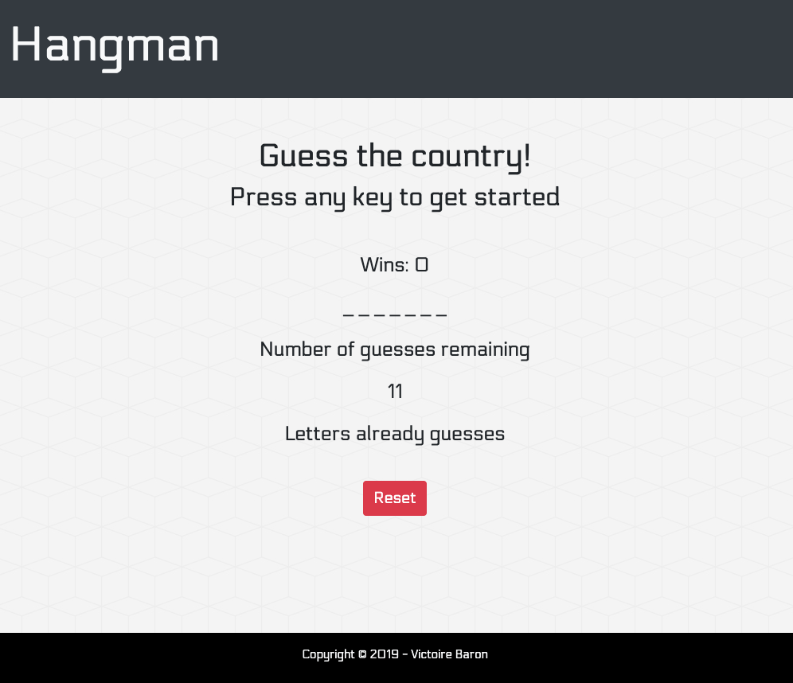

# Word-Guess-Game

## Usage
Open [index](https://victoire44.github.io/Word-Guess-Game) in your browser.

## Presentation
The purpose of this assignment from UC Berkeley extension is to create a computer game in JavaScript.  
**Countries Hangman Game** is a guessing game where users have to guess the country generated by the computer. 

## Technologies Used

* [HTML](https://developer.mozilla.org/en-US/docs/Web/HTML)
* [CSS](https://developer.mozilla.org/en-US/docs/Web/CSS)
* [JavaScript](https://developer.mozilla.org/en-US/docs/Web/JavaScript)

## Author

Victoire Baron | [Victoire44](https://github.com/Victoire44)
